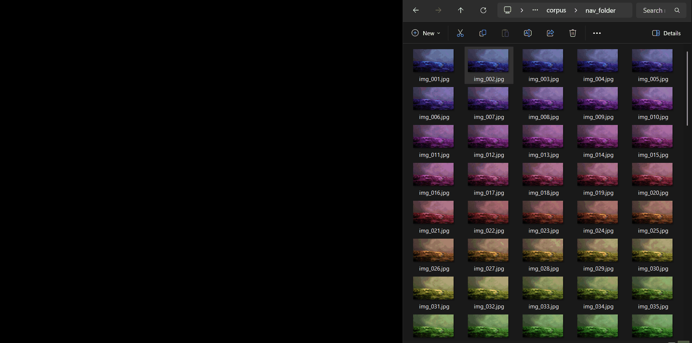

# SuperViewer by Bitcoin.com

A fast image viewer for Windows, built in Rust.


# Quickstart

1. Run the installer (no admin required) 
```bash
installer\install.bat
```
2. Set SuperViewer as the default application for your preferred image formats (eg. png) in the window that opens

3. Open an image by double clicking on it in Windows Explorer 

4. To Uninstall, run:
```bash
installer\uninstall.bat
```


# Screenshot



## Features

- Fast startup (~30 ms)
- Smooth 60+ FPS pan & zoom
- Browse images in folder with (← / →)
- Fast loading of upcoming images
- Drag and drop
- Fullscreen mode
- Rotate and flip (GPU-based, zero CPU cost)
- File details in status bar (filename, resolution, zoom)
- Single self-contained executable

## Supported Formats

JPEG, PNG, Web, BMP, TIFF, GIF, AVIF

## Keyboard Shortcuts

| Key | Action |
|-----|--------|
| Esc | Quit |
| F / F11 | Toggle fullscreen |
| 0 / Numpad 0 | Fit to screen |
| 1 / Numpad 1 | Zoom to 100% (1:1 pixels) |
| R | Rotate 90 clockwise |
| H | Flip horizontal |
| V | Flip vertical |
| Left | Previous image |
| Right / Space | Next image |
| Mouse drag | Pan |
| Scroll wheel | Zoom to cursor |


# What problem we solve

Most image viewers today feel heavier than they should.

They often:

- take noticeable time to launch

- stutter when moving through large folders

- consume excessive memory

- depend on large frameworks or runtimes

- feel sluggish with high-resolution photos

SuperViewer exists to do one thing well: **to open images immediately and let you move through them quickly.**

## Why it is faster 

SuperViewer keeps the stack simple and close to the system:

- Native Windows app: no heavy frameworks or startup cost

- GPU rendering: zoom and transforms handled by your graphics card, not the CPU

- Background decoding:  upcoming images load ahead of time while you view the current one

- In-memory cache: previously viewed images reopen instantly

- Single binary: no external dependencies or runtimes to load

Result: **less waiting, smoother interactions.**


# Benchmarks (The nerdy stuff)

Test machine: Windows 11, i7-11600H, RTX 3050 Ti  
Disk cache warm, median of 10 runs.

Benchmark scripts and raw data in [`benchmarks/`](benchmarks/).

## Cold start (process launch → window visible)

| Image | SuperViewer | IrfanView | JPEGView | qView |
|--------|-------------|-----------|----------|--------|
| 4K JPEG | **37 ms** | 86 ms | 134 ms | 192 ms |
| 4K PNG | **39 ms** | 97 ms | 389 ms | 190 ms |
| 1080p JPEG | **37 ms** | 84 ms | 86 ms | 192 ms |
| 4K WebP | **48 ms** | 84 ms | 232 ms | 184 ms |

## Folder navigation (100 sequential images)

| Viewer | Median |
|-----------|-----------|
| IrfanView | 61 ms |
| JPEGView | 62 ms |
| qView | 62 ms |
| **SuperViewer** | **63 ms** |

## Binary size

| Viewer | Exe | Total Install | Files | DLLs |
|--------|-----|---------------|-------|------|
| **SuperViewer** | 10 MB | **10 MB** | **1** | **0** |
| IrfanView | 2.4 MB | 8.3 MB | 37 | 12 |
| JPEGView | 2.8 MB | 10.3 MB | 54 | 11 |
| qView | 1.5 MB | 96.8 MB | 108 | 71 |

## Memory

SuperViewer uses a larger cache (~512 MB) to enable instant back/forward navigation.  


## Architecture

```
crates/
  viewer-core/      Decode, cache, transforms, directory nav, async pipeline
  viewer-render/    wgpu GPU context, texture upload, shader-based renderer, overlay status bar
  viewer-win32/     Raw Win32 window, WndProc, DPI, drag-drop, fullscreen
  viewer-cli/       CLI argument parsing (clap)
  viewer-app/       Composition root: event loop, state machine, keybindings
assets/
  shaders/
    quad.wgsl       Vertex + fragment shader (transform uniforms)
    overlay.wgsl    Status bar overlay shader (rect-positioned textured quad)
```

## Building 

### Prerequisites

- Rust (stable toolchain)
- MSVC Build Tools
- CMake (for turbojpeg)

### Build

```bash
# Debug
cargo build

# Release (optimized, ~10 MB)
cargo build --release
```

The release binary is at `target/release/superviewer.exe`.

### Installing

```bash
# Run the installer (no admin required)
installer\install.bat
```

This copies `superviewer.exe` to `%LOCALAPPDATA%\SuperViewer\`, registers file associations for JPEG, PNG, BMP, WebP, TIFF, GIF, and AVIF, then opens Windows Settings where you can set SuperViewer as your default app.

To pass a custom exe path (e.g. during development):

```powershell
.\installer\install.ps1 -ExePath "target\release\superviewer.exe"
```

### To ininstall

```bash
installer\uninstall.bat
```

Removes all registry entries and the install directory. Use `-KeepFiles` to only remove associations.

### Run

```bash
# Open an image
cargo run --release -- photo.jpg

# Or run the binary directly
target/release/superviewer.exe C:\path\to\image.png
```

## Testing

See [TESTING.md](TESTING.md) for a full manual test checklist. Quick start:

```bash
# Generate test images (Python 3, no dependencies)
python tests/generate_test_images.py

# Run the viewer against test images
target/release/superviewer.exe tests/images/test_gradient.bmp
```

## Build Dependencies

| Crate | Version | Purpose |
|-------|---------|---------|
| wgpu | 28 | GPU rendering (DX12/Vulkan) |
| windows | 0.61 | Win32 API |
| turbojpeg | 1.4 | Fast JPEG decode |
| image | 0.25 | PNG, BMP, TIFF, GIF, AVIF decode |
| webp | 0.3 | WebP decode |
| fast_image_resize | 5.1 | Display downsampling |
| rayon | 1.10 | Thread pool for decode |
| crossbeam-channel | 0.5 | Bounded channels for pipeline |
| clap | 4 | CLI parsing |
| bytemuck | 1 | Safe transmute for GPU uniforms |


Made with <3 at Bitcoin.com